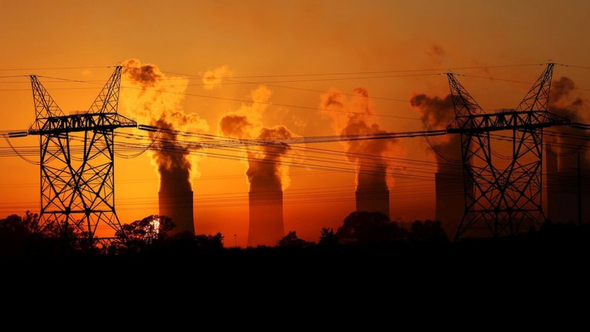

A growing body of scholarship exists on electricity and power supply in Africa and African technological history more broadly. Much of the debate within these fields has been within the context of political economic history, science and technology, with less attention on the social and cultural history of Africa. Historians of African development have increasingly emphasized electricity as a contested resource, where the struggle between industrial consumption and household access reflects deeper debates about modernization and dependency. Modernization theorists often interpret the prioritization of industry as a necessary stage in national progress, arguing that channeling electricity toward factories and infrastructure would advance economic growth and urban expansion. In contrast, colonial and postcolonial scholars highlight how this uneven distribution entrenched inequality, leaving households marginalized and reinforcing patterns of exclusion within cities. More recent social histories complicate both perspectives by showing how everyday struggles for domestic electricity, whether through informal connections, community organizing, or state neglect, shaped urban life as much as industrial policy.

<small>  Fig.2: *Power distribution across different locations in Africa*

### Historiography

Scholars accros the world have examined electricity and its role as a driver of industrialization, reshaping patterns of class and economic labor while simultaneously reinforcing and challenging the authority of the state and capital. Scholarship has traced electricity’s entanglement with colonial legacies, where infrastructure projects both symbolized and sustained imperial power, and where questions of social inequality and access revealed deep fractures in the distribution of modernity. Studies of urban development and economic transformation highlight electricity’s capacity to generate prosperity while also producing new dependencies and vulnerabilities. At the same time, historians have emphasized its political symbolism, like electric light as a marker of modernization, electrification projects as instruments of donor influence and privatization, and the contested agency of communities navigating the politics of technological change. These perspectives situate electricity not as a neutral technology but as a site of conflict, and a dynamic arena in which power, inequality, and visions of progress have been

In the last decade of the nineteenth century, electricity began to replace steam power as the most important form of energy that reshaped everyday life and industry. Beginning with the seminar work of Thomas Hughes, *Network of Power*, though focused on Western contexts, provides a comparative framework for understanding how electrification became embedded in broader networks of authority and modernization. Historians have researched this energy system and its influence on modern life. Hughes argues that power networks are not only technical but also “cultural artefacts” shaped by variations in resources, traditions, economics, and politics across societies over time.[^6] He focused not merely on the technology itself but on the various actors, institutions, and machines, and how they impacted the everyday lives of people, both in the domestic space and the industry. In Hughes’s account, private businesses invented and launched power systems, which grew incrementally and eventually became part of a country’s landscape. Studies of electrification in the nineteenth and early twentieth-century Africa focused largely on the settler colonies of South Africa. The focus on Southern Africa rose because the region was one of the first in the world to use electricity on a wide scale, owing to its mining mechanization activities.

The studies emphasized exploitation and racial exclusion. Colonial electrification functioned as a powerful instrument of industrial economic labour and growth, class formation, and political authority. Renfrew Christie’s *Electricity, Industry and Class in South Africa* demonstrates how electrification in a settler colony was driven by mining interests, with industrial consumption prioritized over household access. The introduction of electricity in South Africa served the needs of the gold mining industry, reinforcing the power of capital over labour. Electricity-enabled mechanization intensified the exploitation of African workers while benefiting mining owners. Race was a key element in apartheid South Africa. The racial system created a disparity and segregation between white settlers and the black community. The white community controlled the various mining and capital investments in South Africa, which affected the distribution of electricity in South African communities. Electricity is mostly supplied under capitalism and a monopoly.[^7] In the Transvaal, the parties with the best control of the state were the gold mine owners. He argues that electricity was celebrated as the “spirit of progress” in South Africa, yet its distribution entrenched inequality, serving the state and property owners through their industrial systems and capitalist infrastructure.[^8] Electrification became a mechanism of social control, reinforcing settler power through surveillance, propaganda, and the protection of property. This book explicitly connects electrification to class formation in South Africa, situating electricity within the broader political economy of apartheid.

In contrast, Adewumi Adebayo’s *Electricity, Agency, and Class in Lagos Colony* highlights African agency in shaping electrification, showing how returnees exposed to European lifestyles demanded access and influenced colonial policy. He demonstrates that Lagos is arguably one of the African territories where electricity supply does not depend on mining or industrial ambitions. Instead, the colonial state introduced electricity as a project of modernity and a status symbol for the Lagos middle class.[^9] Relying heavily on colonial newspapers, letters, reports, and minutes, the missionaries, through their education and interactions with European officials, familiarized the people with electronics before the electric bulb. The African residents of the colony knew about electricity during the 1890s, even though a power plant had not yet been built. The knowledge gained by the people of Lagos influenced their desire and demand for electric street and home lighting. Electric lighting was an initiative of the colonial government and the mercantile class, represented by the Lagos Chamber of Commerce. This mercantile class influenced the distribution of electricity to the public. The electrification of residential neighborhoods followed a class-based pattern. Wealthy neighborhoods had a first-mover advantage and had enjoyed streetlights and domestic electricity since 1898, while less affluent areas did not. The lights symbolized a practical demonstration of ‘modernization as spectacle.’[^10] Electricity was consistently described as a luxury during the 1900s, and access to it was largely class-based.

Comparative historical studies of colonial Africa reveal diverse trajectories, reflecting racial hierarchies, industrial priorities, urban modernity, and development. Colonial electricity supplies have been discussed by scholars within the context of urban development associated with industrialization and export commodities. These development frameworks often project an uneven distribution of electricity supply. Electricity supply was seen as both a mechanism of exclusion and a site of negotiation within colonial societies. Gail Wilson’s *Owen Falls: Electricity in a Developing Country* illustrates how electrification projects in Uganda were framed as development initiatives, but often reinforced dependency and inequality. The Owen Falls dam was expected to supply electricity to industry in Jinja and to a lesser extent in Kampala, and power and light to the richer inhabitants of these towns, Entebbe, and later Masaka, but there was therefore little prospect of mass rural electrification, and the lines were built to supply isolated cotton ginneries and coffee factories, estates, and the larger trading centers.[^11] Industrial electricity consumption was concentrated in the urban areas, but the actual definition of urban or even of industry was by no means straightforward. Urban centers were considered areas with a large non-African population. While the project was promoted as a symbol of modernization and national development, its distribution shows that electricity provision was shaped by colonial legacies, uneven access, and economic constraints, meaning its benefits were concentrated in industry and urban elites rather than the wider population.[^12]

Catherine Coquery-Vidrovitch’s *Electricity Networks in Africa*: A Comparative Study builds directly on these insights, expanding the critique from a single case to a continent-wide analysis of electricity networks. He examines port cities to highlight how colonial authorities distributed electricity unevenly, often privileging European settlers while excluding the indigenous population. He argues that industrial resources and the settlement of colonizing people motivated the widespread use of electricity within territories in Africa, where their duties demanded the use of electricity. Racial dynamics within the colonial system had a greater influence on the distribution of electricity to the local people, which also contributed to the lack of access for the “native” population to its usage.

In the postcolonial era, electricity became a contested space for reforms and development, highlighting the persistent inequalities inherited from colonial infrastructure. Neo-liberal politics and infrastructure investments became preconditions for African leaders in accessing financial assistance for development. Electricity in Sub-Saharan Africa has been shaped by neo-liberal powers, and postcolonial African leaders have utilized electricity and infrastructure differently to influence national politics. Post -1960 Africa had various development finance institutions that emerged as major funders for power projects. David A. McDonald’s Electric Capitalism: Conceptualizing Electricity and Capital Accumulation in (South) Africa argues that electricity has become an integral part of all capitalist activity, and the inequities of its availability and affordability are best understood in the market dynamics within which it operates.[^13]  He introduces the idea of “electric capitalism,” showing how privatization and liberalization of power utilities function as a new form of recolonization, where multinational corporations profit while millions remain excluded from access.[^14]  Electrification in Africa became one of the avenues for the spread of neoliberal ideological imperialism after independence. Capitalist and financial institutions seek to invest largely in this area for capital accumulation.  

#### Conclusion 

The body of scholarship on electrification in Africa reveals a profound historiographical shift from celebratory narratives of modernization to critical analyses of inequality, displacement, and contested development. These scholars focused on the social, political, and economic impacts of electricity supply, with early historians emphasizing mining and industrial supply of electrification, both within colonial and postcolonial arenas. 
The earliest study of electrification began with Gail Wilson’s early study of Owen Falls, which inaugurated this trajectory by exposing the limits of electrification as a developmental tool in postcolonial Uganda, while Renfrew Christie’s work in South Africa deepened the critique by situating electricity within the structures of class exploitation and racialized capitalism. Catherine Coquery Vidrovitch expanded the conversation to a continental scale, demonstrating that the patterns Wilson identified were replicated across Africa, embedding electricity networks in colonial and postcolonial inequalities. Allen and Barbara Isaacman sharpened the focus on displacement and the “delusion of development” through their study of Cahora Bassa, while Kate Showers reframed electrification as an ecological disruption, and Stephan Miescher localized the environmental and social consequences in Ghana’s Akosombo Dam. David McDonald’s Electric Capitalism carried the critique into the neoliberal era, conceptualizing electricity as a mechanism of capital accumulation and recolonization, a theme that Christopher Gore extended by showing how these dynamics are mediated through governance and reform politics in Uganda. Finally, Hanaan Marwah’s quantitative analysis of electricity access inequality reframes electrification itself as a measure of economic inequality, positioning access as central to debates on poverty and growth.
These works chart the evolution of historiography from early development critiques to complexities of class, displacement, environment, neoliberal globalization, governance, and inequality. They converge on the recognition that electricity in Africa has never been a neutral technology but a deeply political, social, and ecological force. By situating electrification at the intersection of power, inequality, and transformation, this scholarship not only challenges modernization narratives but also establishes electricity as a critical lens for understanding Africa’s economic and social history.

[^6]: Thomas Parke Hughes, *Networks of Power: Electrification in Western Society, 1880-1930* (JHU Press, 1993), 1-17
[^7]:Christie Renfrew. *Electricity, industry and Class in South Africa.* (State University of New York Press, 1984), p. 1-98
[^8]:Christie Renfrew. *Electricity, industry and Class in South Africa.* (State University of New York Press, 1984), p. 27
[^9]:Adebayo D. Adewumi. "Electricity, Agency and Class in Lagos Colony, c. 1816-1914," *Past and Present,* Volume 262, Issue 1, February 2024, p. 168-206. 
[^10]:Adebayo D. Adewumi. "Electricity, Agency and Class in Lagos Colony," 199. 
[^11]:Gail Wilson, *Owen Falls; Electricity in a Developing Country* (East African Publishing House, 1967), 1-23
[^12]:Gail Wilson, *Owen Falls; Electricity in a Developing Country,* 63.
[^13]:David A. McDonald, "Electric Capitalism: Conceptualizing Electricity and Capital Accumulation in (South) Africa," in *Electric Capitalism: Recolonizing Africa on the Power Grid* (HSRC Press, 2012), 1–46. 
[^14]:McDonald, “Electric Capitalism: Conceptualizing Electricity and Capital Accumulation in (South) Africa,” 4.