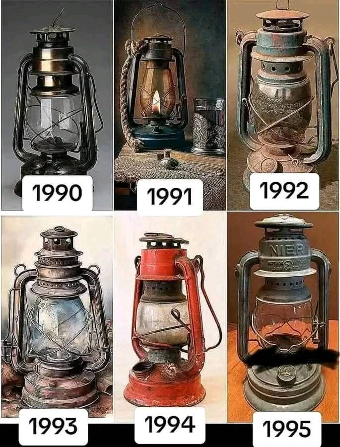

## Introduction 

A growing body of scholarship exists on electricity and power supply in Africa and African technological history more broadly. Much of the debate within these fields has been within the context of political economic history, science and technology, with less attention on the social and cultural history of Africa. Historians of African development have increasingly emphasized electricity as a contested resource, where the struggle between industrial consumption and household access reflects deeper debates about modernization and dependency. Modernization theorists often interpret the prioritization of industry as a necessary stage in national progress, arguing that channeling electricity toward factories and infrastructure would advance economic growth and urban expansion. In contrast, colonial and postcolonial scholars highlight how this uneven distribution entrenched inequality, leaving households marginalized and reinforcing patterns of exclusion within cities. More recent social histories complicate both perspectives by showing how everyday struggles for domestic electricity, whether through informal connections, community organizing, or state neglect, shaped urban life as much as industrial policy. 

### Historiography 

Scholars accros the world have examined electricity and its role as a driver of industrialization, reshaping patterns of class and economic labor while simultaneously reinforcing and challenging the authority of the state and capital. Scholarship has traced electricity’s entanglement with colonial legacies, where infrastructure projects both symbolized and sustained imperial power, and where questions of social inequality and access revealed deep fractures in the distribution of modernity. Studies of urban development and economic transformation highlight electricity’s capacity to generate prosperity while also producing new dependencies and vulnerabilities. At the same time, historians have emphasized its political symbolism, like electric light as a marker of modernization, electrification projects as instruments of donor influence and privatization, and the contested agency of communities navigating the politics of technological change. These perspectives situate electricity not as a neutral technology but as a site of conflict, and a dynamic arena in which power, inequality, and visions of progress have been

In the last decade of the nineteenth century, electricity began to replace steam power as the most important form of energy that reshaped everyday life and industry. Beginning with the seminar work of Thomas Hughes, Network of Power, though focused on Western contexts, provides a comparative framework for understanding how electrification became embedded in broader networks of authority and modernization. Historians have researched this energy system and its influence on modern life. Hughes argues that power networks are not only technical but also “cultural artefacts” shaped by variations in resources, traditions, economics, and politics across societies over time.  He focused not merely on the technology itself but on the various actors, institutions, and machines, and how they impacted the everyday lives of people, both in the domestic space and the industry. In Hughes’s account, private businesses invented and launched power systems, which grew incrementally and eventually became part of a country’s landscape.
Studies of electrification in the nineteenth and early twentieth-century Africa focused largely on the settler colonies of South Africa. The focus on Southern Africa rose because the region was one of the first in the world to use electricity on a wide scale, owing to its mining mechanization activities. 

The studies emphasized exploitation and racial exclusion. Colonial electrification functioned as a powerful instrument of industrial economic labour and growth, class formation, and political authority. Renfrew Christie’s Electricity, Industry and Class in South Africa demonstrates how electrification in a settler colony was driven by mining interests, with industrial consumption prioritized over household access. The introduction of electricity in South Africa served the needs of the gold mining industry, reinforcing the power of capital over labour. Electrification. Electricity-enabled mechanization intensified the exploitation of African workers while benefiting mining owners.  Race was a key element in apartheid South Africa. The racial system created a disparity and segregation between white settlers and the black community. The white community controlled the various mining and capital investments in South Africa, which affected the distribution of electricity in South African communities. Electricity is mostly supplied under capitalism and a monopoly.  In the Transvaal, the parties with the best control of the state were the gold mine owners. He argues that electricity was celebrated as the “spirit of progress” in South Africa, yet its distribution entrenched inequality, serving the state and property owners through their industrial systems and capitalist infrastructure.  Electrification became a mechanism of social control, reinforcing settler power through surveillance, propaganda, and the protection of property. This book explicitly connects electrification to class formation in South Africa, situating electricity within the broader political economy of apartheid.
